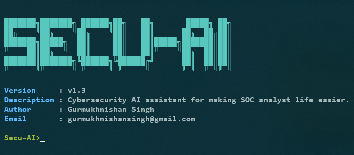

# Secu-AI: AI-Powered Cybersecurity Assistant (Interactive Terminal)

Secu-AI is an open-source, AI-powered cybersecurity assistant that provides an interactive terminal interface for users to query and analyze threat intelligence data. By leveraging the power of AI and integrating with popular cybersecurity tools and services, Secu-AI offers a user-friendly platform for threat intelligence, analysis, and response.

## Features

### 🔍 **Threat Intelligence and Analysis**

- **VirusTotal Lookup**: Perform real-time VirusTotal lookups to check the reputation of files, URLs, domains, and IP addresses. Secu-AI integrates with the VirusTotal API to provide up-to-date and accurate threat intelligence data.
#### **Future Feature for Threat Intelligence**
- **AlienVault OTX Integration**: Correlate threat intelligence data with AlienVault's Open Threat Exchange (OTX) to gain insights into global threat activity and identify potential threats targeting your organization.
- **Whois Lookup**: Perform WhoIs lookups to gather information about the ownership and registration details of domains and IP addresses, helping you to identify suspicious or malicious activity.
- **Phishing Analysis**: Analyze URLs and emails to detect phishing attempts and other social engineering attacks. Secu-AI uses machine learning algorithms and AI models to identify and classify potential phishing threats.
- **Log Correlation**: Analyze and correlate logs from various security tools and systems to identify patterns, anomalies, and potential threats that may have been missed by individual tools.
### 💡 **AI-Driven Insights and Recommendations**

- **Natural Language Processing (NLP)**: Secu-AI uses advanced NLP techniques to understand and interpret user queries, providing relevant and accurate responses to cybersecurity-related questions.
- **AI Model Integration**: Integrate custom AI models and machine learning algorithms to extend the capabilities of Secu-AI and tailor it to your organization's specific needs.

### Demo
**How to make SOC analyst life for getting the Logs from Machine or SIEM Solution using Secu-AI**
 
**How to \ using Secu-AI**

## Contributing

Contributions are welcome! If you encounter any bugs or have suggestions for new features, please submit an issue or pull request. Make sure to follow the project's coding standards and guidelines.

## License

Secu-AI is licensed under the MIT License. See the [LICENSE](LICENSE) file for more information.

---

Secu-AI is an open-source project designed to help security professionals and IT administrators enhance their cybersecurity capabilities. By providing an interactive terminal interface, Secu-AI offers a user-friendly platform for querying and analyzing threat intelligence data, enabling users to quickly and easily gain insights into potential threats.
